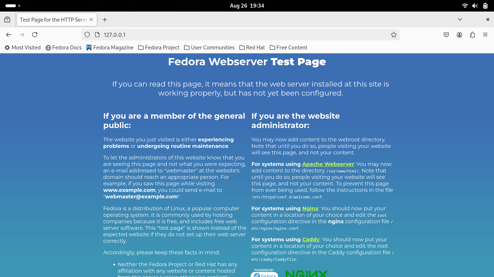
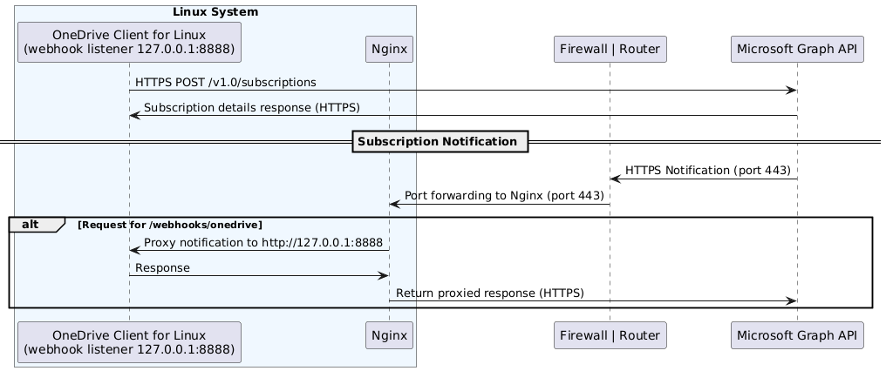

# How to configure receiving real-time changes from Microsoft OneDrive using webhooks

When operating in 'Monitor Mode,' receiving real-time updates to online data can significantly enhance synchronisation efficiency. This is achieved by enabling 'webhooks,' which allows the client to subscribe to remote updates and receive real-time notifications when certain events occur on Microsoft OneDrive.

With this setup, any remote changes are promptly synchronised to your local file system, eliminating the need to wait for the next scheduled synchronisation cycle.

> [!IMPORTANT]
> In March 2023, Microsoft updated the webhook notification capability in Microsoft Graph to only allow valid HTTPS URLs as the destination for subscription updates.
>
> This change was part of Microsoft's ongoing efforts to enhance security and ensure that all webhooks used with Microsoft Graph comply with modern security standards. The enforcement of this requirement prevents the registration of subscriptions with non-secure (HTTP) endpoints, thereby improving the security of data transmission.
>
> Therefore, as a prerequisite, you must have a valid fully qualified domain name (FQDN) for your system that is externally resolvable, or configure Dynamic DNS (DDNS) using a provider such as:
> * No-IP
> * DynDNS
> * DuckDNS
> * Afraid.org
> * Cloudflare
> * Google Domains
> * Dynu
> * ChangeIP
>
> This FQDN will allow you to create a valid HTTPS certificate for your system, which can be used by Microsoft Graph for webhook functionality.
>
> Please note that it is beyond the scope of this document to provide guidance on setting up this requirement.

Depending on your environment, a number of steps are required to configure this application functionality. At a very high level these configuration steps are:

1. Application configuration to enable 'webhooks' functionality
2. Install and configure 'nginx' as a reverse proxy for HTTPS traffic
3. Install and configure Let's Encrypt 'certbot' to provide a valid HTTPS certificate for your system using your FQDN
4. Configure your Firewall or Router to forward traffic to your system

> [!NOTE]
> The configuration steps below were validated on [Fedora 40 Workstation](https://fedoraproject.org/)
>
> The installation of required components (nginx, certbot) for your platform is beyond the scope of this document and it is assumed you know how to install these components. If you are unsure, please seek support from your Linux distribution support channels.

### Step 1: Application configuration

#### Enable the 'webhook' application feature
*  In your 'config' file, set `webhook_enabled = "true"` to activate the webhook feature.

#### Configure the public notification URL
*  In your 'config' file, set `webhook_public_url = "https://<your.fully.qualified.domain.name>/webhooks/onedrive"` as the public URL that will receive subscription updates from the Microsoft Graph API platform.

> [!NOTE]
> This URL should utilise your FQDN and be resolvable from the Internet. This URL will also be used within your 'nginx' configuration.

#### Testing
At this point, if you attempt to test 'webhooks', when they are attempted to be initialised, the following error *should* be generated:
```
ERROR: Microsoft OneDrive API returned an error with the following message:
  Error Message:    HTTP request returned status code 400 (Bad Request)
  Error Reason:     Subscription validation request timed out.
  Error Code:       ValidationError
  Error Timestamp:  YYYY-MM-DDThh:mm:ss
  API Request ID:   eb196382-51d7-4411-984a-45a3fda90463
Will retry creating or renewing subscription in 1 minute
```
This error is 100% normal at this point.

### Step 2: Install and configure 'nginx'

> [!NOTE]
> Nginx is a web server that can also be used as a reverse proxy, load balancer, mail proxy and HTTP cache.

#### Install and enable 'nginx'
*  Install 'nginx' and any other requirements to install 'nginx' on your platform. It is beyond the scope of this document to advise on how to install this. Enable and start the 'nginx' service.

> [!TIP]
> You may need to enable firewall rules to allow inbound http and https connections:
> ```
> firewall-cmd --permanent --zone=public --add-service=http
> firewall-cmd --permanent --zone=public --add-service=https
> ```

#### Verify your 'nginx' installation
* From your local machine, attempt to access the local server now running, by using a web browser and pointing at http://127.0.0.1/



#### Configure 'nginx' to receive the subscription update
*  Create a basic 'nginx' configuration file to support proxying traffic from Nginx to the local 'onedrive' process, which will, by default, have an HTTP listener running on TCP port 8888
```
server {
	listen 443;
	server_name <your.fully.qualified.domain.name>;
	location /webhooks/onedrive {
		# Allow only Microsoft 365 Common and Office Online addresses
		# Taken from "Azure IP Ranges and Service Tags – Public Cloud" page. Microsoft updates this JSON file weekly
		# https://www.microsoft.com/en-us/download/details.aspx?id=56519
		allow 20.20.32.0/19;
		allow 20.190.128.0/18;
		allow 20.231.128.0/19;
		allow 40.126.0.0/18;
		deny all;

		# Proxy Options
		proxy_http_version 1.1;
		proxy_pass http://127.0.0.1:8888;
	}
}
```
The configuration above will:
* Create an endpoint listener at `https://<your.fully.qualified.domain.name>/webhooks/onedrive
* Secure this endpoint to only allow Microsoft 365 address space to communicate with this enpoint

> [!IMPORTANT]
> These ranges are part of the Microsoft 365 Common and Office Online services, which also cover Microsoft Graph API. You should regularly update the allowlist as Microsoft updates these ranges frequently.
> It is recommended to automate updates to your 'nginx' configuration accordingly and is beyond the scope of this document.

> [!TIP]
> Save this file in the nginx configuration directory similar to the following path: `/etc/nginx/conf.d/onedrive_webhook.conf`. This will help keep all your configurations organised.

*  Test your 'nginx' configuration using `sudo nginx -t` to validate that there are no errors. If any are identified, please correct them.
*  Once tested, reload your 'nginx' configuration to activate the webhook reverse proxy configuration.


### Step 3: Configure 'certbot' to create a SSL Certificate and deploy to your 'nginx' webhook configuration


*   **Setup Nginx as a Reverse Proxy:** Configure Nginx to listen on port 443 for HTTPS traffic. It should proxy incoming webhook notifications to the internal webhook listener running on the client

### Step 4: Firewall/Router Configuration
*   **Port Forwarding:** Ensure that your firewall or router is configured to forward incoming HTTPS traffic on port 443 to the internal IP address of your Nginx server. This setup allows external webhook notifications from the Microsoft Graph API to reach your Nginx server and subsequently be proxied to the local webhook listener.

When these steps are followed, your environment configuration will be similar to the following diagram:



Refer to [application-config-options.md](application-config-options.md) for further guidance on 'webhook' configuration options.
